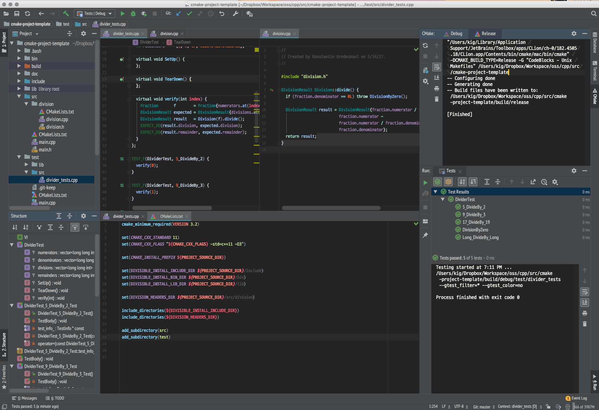

[](https://travis-ci.org/kigster/cmake-project-template)

# CMake C++ Project Template

### Division with a remainder library

Thank you for your interest in this project!

Are you just starting with `CMake` or C++?

Do you need some easy-to-use starting point, but one that has the basic moving parts you are likely going to need on any medium sized project?

Do you believe in test-driven development, or at the very lest — write your tests *together* with the feature code? If so you'd want to start your project pre-integrated with a good testing framework.

Divider is a minimal project that's kept deliberately very small. When you build it using CMake/make (see below) it generates:

 1. A tiny **static library** `lib/libdivision.a`,
 2. **A command line binary `bin/divider`**, which links with the library,
 3. **An executable unit test** `bin/divider_tests`  using [Google Test library](https://github.com/google/googletest).
 4. **An optional BASH build script** `./run.sh` that is also used by the Travis CI.


## Usage

### Prerequisites

You will need:

 * A modern C/C++ compiler
 * CMake 3.1+ installed (on a Mac, run `brew install cmake`)
 * If you prefer to code in a great IDE, I highly recommend [Jetbrains CLion](https://www.jetbrains.com/clion/). It is fully compatible with this project.

### Building The Project

#### Git Clone

First we need to check out the git repo:

```bash
$ cd ${insert your workspace folder here}
$ git clone https://github.com/kigster/cmake-project-template my-project
$ cd my-project
$ git submodule init && git submodule update
```

Now we should be in the project's top level folder. 

#### Project Structure

There are three empty folders: `lib`, `bin`, and `include`. Those are populated by `make install`.

The rest should be obvious: `src` is the sources, and `test` is where we put our unit tests.

Now we can build this project, and below we show three separate ways to do so.

#### Building Manually

```bash
$ rm -rf build/manual && mkdir build/manual
$ cd build/manual
$ cmake ../..
$ make && make install
$ cd ../..

# Run the tests:
$ bin/divider_tests 

# Run the binary:
$ bin/divider 234 5431
```

####  Building Using the Script

There is a handy BASH script (used by the Travis CI) that you can run locally. It builds the project, and runs all the tests

```bash
./run.sh
```

#### Building in CLion

> **NOTE**: Since JetBrains software [does not officially support git submodules](https://youtrack.jetbrains.com/issue/IDEA-64024), you must run `git submodule init && git submodule update` before starting CLion on a freshly checked-out repo.

> **NOTE**: We recommend that you copy file `.idea/workspace.xml.example` into `.idea/workspace.xml` **before starting CLion**. It will provide a good starting point for your project's workspace.

Assuming you've done the above two steps, you can start CLion, and open the project's top level folder. CLion should automatically detect the top level `CMakeLists.txt` file and provide you with the full set of build targets.

Select menu option **Run ➜ Build**, and then **Run ➜ Install**.



The above screenshot is an example of CLion with this project open.

## Feature Description

To make it easy to branch off from this template, the example is minimal, but it works, compiles and is tested.

We build a static library that, given a simple fraction will return the integer result of the division, and the remainder.

```bash
$ bin/divider numerator denominator

# eg:
$ divider 234 5435

Division : 234 / 5435 = 0
Remainder: 234 % 5435 = 234
```

And C++ usage:

```C++
#include <iostream>
#include <division>

Fraction       f = Fraction{25, 7};
DivisionResult r = Division(f).divide();

std::cout << "Result of the division is " << r.division;
std::cout << "Remainder of the division is " << r.remainder;
```

## File Locations

 * `src/*` — C++ code that ultimately compiles into a library
 * `test/lib` — C++ libraries used for tests (eg, Google Test)
 * `test/src` — C++ test suite
 * `bin/`, `lib`, `include` are all empty directories, until the `make install` install the project artifacts there.

Tests:

 * A `test` folder with the automated tests and fixtures that mimics the directory structure of `src`.
 * For every C++ file in `src/A/B/<name>.cpp` there is a corresponding test file `test/A/B/<name>_test.cpp`
 * Tests compile into a single binary `test/bin/runner` that is run on a command line to run the tests.
 * `test/lib` folder with a git submodule in `test/lib/googletest`, and possibly other libraries.

#### Contributing

**Pull Requests are WELCOME!** Please submit any fixes or improvements, and I promise to review it as soon as I can at the project URL:

 * [Project Github Home](https://github.com/kigster/cmake-project-template)
 * [Submit Issues](https://github.com/kigster/cmake-project-template/issues)
 * [Pull Requests](https://github.com/kigster/cmake-project-template/pulls)

### License

&copy; 2017-2018 Konstantin Gredeskoul.

Open sourced under MIT license, the terms of which can be read here — [MIT License](http://opensource.org/licenses/MIT).

### Acknowledgements

This project is a derivative of the [CMake Tutorial](https://cmake.org/cmake-tutorial/), and is aimed at saving time for starting new projects in C++ that use CMake and GoogleTest.
